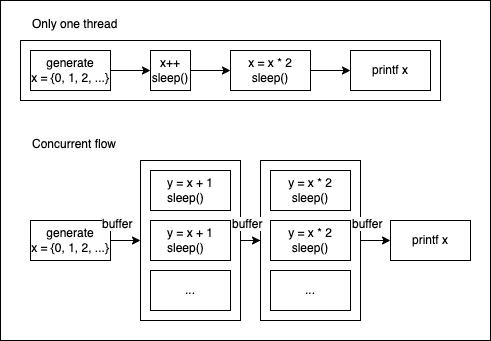

# Objective of the project
- A demonstartion of concurrency via pthread.
- Comparsion among design with and without concurrency based on proccess time.

## Comparison result
||thread number|CPU time used|Real-time elapsed|
| :---: | :---: | :---: | :---: |
|without concurrency|only main|0.001935 seconds|0.016363 seconds|
|with concurrency|1+1+1+1|0.004293 seconds|0.006486 seconds|
||1+2+2+1|0.004239 seconds|0.004039 seconds|
||1+3+3+1|0.004596 seconds|0.003946 seconds|

hint:
- **CPU time used** is the total CPU bound period.
- **Real-time elapsed** is the period the whole proccess have been through.
- **The sleep function** in C suspends thread, but will not consume CPU time.
- The clock function un C often used to measures CPU time used by the program. It counts the number of clock ticks used by the CPU to execute the program.
- Other functions like gettimeofday, clock_gettime, or time can provide real time stamp including the span in sleep and I/O bound.

explain of the result:
- In term of **CPU time used**, the concurrency design doesn't beat the original design. The poossible explaination is because it will cost CPU **additional time to manage threads**. However, I also have embeded sleep function (for mocking the CPU bound or I/O bound) in the program that didn't count on the CPU time.
- In term of **Real-time elapsed**, the concurrency design ourperforms the original design. Because the concurrency design is aiming to break down a task into severval parts (either the part is CPU bound or I/O bound) and solve the parts in a parallel manner, this result is quite coherent with the expectation.

## Conculsion
- It is nice to consider concurrency into design. A concurrency design could make the proccessing of tasks **become more interactive**. To put it simple, it can overlapping the proccessing period when tasks can work in parallel.
- However, it is not a better in all cases. It is cruicial to examine:
    - if the problem or tasks could be break down and perform in parallel manner?
    - do we have sufficient resources such as CPU cores, memory, or I/O bandwidth to support the concurrentcy design?
    - the possibility to have sufficient performance gains after applying.
- Because concurrentcy design is more complex and could cost extra overhead such as context switch or difficulty to debug or fix, it is better to ***think before leap***.

# Sourse code markdown

## Task description

to perform (x + 1) * 2 on a list of x. \
(we want to make sure procedure order for each x is correct)

- Simple design (only one thread)
- Concurrency design

## Program description

- Non-Concurrent design
  * sequential proccessing x >> x += 1 >> x *= 2 >> prinf x
  * only main function calling producer_consumer function

- Concurrent design

  -- **Buffer struct** for synchronization of data
  * this struct will not only provide a space for produser and consumer, but make sure the data flow work in order (x >> x += 1 >> x *= 2 >> prinf x).
  * ***produce function*** to add item to the buffer, wait if the buffer is full, and decrease empty count.
  * ***consume function*** to remove item from the buffer, wait if the buffer is empty, and decrease full count.

  -- **The functions** for independent sub-tasks
  * **producer and consumer**: create list of x / printf list of result(x)
  * **add_one and multiple_two**: perform x + 1 / perform x * 2
  * **main function**: initializes the buffers and locks, creates the threads, and use signal to implement timeout mechanism. 

## How to run the code

Here is a quick link to run the code on the internet with ease. \
https://www.onlinegdb.com/online_c_compiler

# Notes about Concurrency

## What is concurrency
- the ability of a system to execute multiple tasks interatively, like performing tasks while play the music at the same time.
- a design to break down task into multiple sub-tasks that can cooperate in concurrent manner, which can speed up the whole process.

## How to do concurrency

### Multithreading and Multiprocessing:
- This involves running **multiple threads or processes**. Each thread or proccess represents a separate flow of control within the program, allowing different tasks to be executed concurrently.

### Asynchronous Programming: 
- Asynchronous programming **allows tasks to run independently of the main program flow**. This is commonly used in event-driven and non-blocking I/O systems, where tasks can be started and completed asynchronously without blocking the main program execution.

### Parallel Computing:
- Parallel computing involves dividing a task into smaller sub-task that can be executed simultaneously on **multiple processing units**. This can include parallelizing algorithms across CPU cores, using GPU computing, or even distributed computing across multiple machines.

### Message Passing:
- Message passing concurrency involves communication between separate processes or threads through message passing mechanisms. This can include passing messages through channels, message queues, or shared memory.

## Concurrency is not always beneficial 

Here are some conditions or scenarios where concurrency may not be suitable or beneficial:

1. Low Parallelism: \
If the problem or task does not lend itself to parallel execution and there are few independent subtasks to execute concurrently, introducing concurrency may introduce unnecessary complexity without significant performance gains.

3. Synchronization Overhead: \
If the overhead of synchronizing access to shared resources (e.g., locks, semaphores) outweighs the benefits gained from parallel execution, concurrency may not be beneficial. Excessive synchronization can lead to contention, bottlenecks, and reduced scalability.

4. Limited Resources: \
If the system has limited resources such as CPU cores, memory, or I/O bandwidth, introducing concurrency may lead to resource contention and reduce overall performance due to increased context switching and contention for shared resources.

5. Sequential Dependencies: \
If the tasks or operations have inherent sequential dependencies or require strict ordering of execution, parallelizing them may not be feasible or may introduce correctness issues. In such cases, concurrency may be counterproductive or require complex synchronization mechanisms.

6. I/O-bound Workloads: \
If the tasks involve predominantly I/O-bound operations (e.g., disk I/O, network I/O) rather than CPU-bound computations, concurrency may not provide significant performance improvements. In I/O-bound scenarios, the benefits of parallel execution may be limited by the speed of I/O operations.

7. Complexity and Maintenance: \
Introducing concurrency adds complexity to the system design, implementation, and debugging. If the complexity introduced by concurrency outweighs the benefits in terms of performance or scalability, it may not be justified.

8. Concurrency Hazards: \
Some problems may exhibit concurrency hazards such as race conditions, deadlocks, livelocks, or priority inversion. If these hazards are difficult to mitigate or can lead to correctness or performance issues, concurrency may not be advisable.

Notes:
+ The program with connrent design here will use STOP_SIGNAL (- 1) as message to stop the whole program, this will prevent the necessity to releasing lock under timeout senario.
